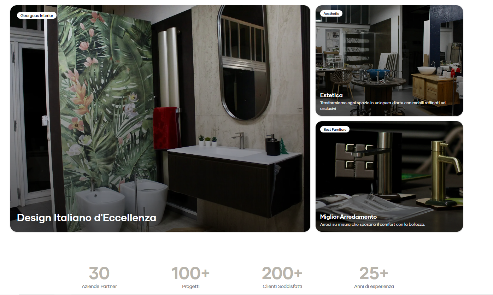

# Contact Arredo

Contact Arredo è un sito web moderno e minimale realizzato per un’azienda specializzata in arredamento e soluzioni di interior design.  
Il progetto pone al centro **eleganza, semplicità e cura del dettaglio**, mantenendo una struttura chiara e un’esperienza di navigazione fluida.

> **Demo Online:** https://contact-arredo.vercel.app/

---

## 🖼️ Anteprima



## 🟩 Brand Identity

Lo stile visivo si ispira al design **scandinavo e nordico**:  
palette neutra, spaziature ampie, tipografia pulita, nessuna distrazione.  
Ogni elemento guida l’utente verso un’esperienza visiva **calma, solida e professionale**.

**Valori comunicati:**

- Qualità artigianale
- Ordine e razionalità
- Eleganza senza ostentazione
- Professionalità e affidabilità

---

## ✨ Caratteristiche Principali

### Homepage d’impatto e orientata alla percezione del brand

- Hero fotografico in alta qualità
- Call-to-action chiara e diretta
- Layout coerente e ritmato

### Catalogo Prodotti Strutturato

- Articoli ordinati per categorie
- Focus sull’oggetto, senza sovraccarico grafico
- Descrizioni curate, immagini ottimizzate

### Sezione "Chi Siamo"

Racconta l’identità dell’azienda, con attenzione a:

- storia e competenze
- filosofia progettuale
- visione estetica

### Contatti Chiari e Funzionali

- Form integrato con validazione
- Invio email via **Nodemailer**
- Dettagli di contatto disponibili in chiaro

### Responsive & Cross-Device

- Mobile-first
- Layout flessibile
- Immagini ottimizzate per tutte le risoluzioni

### Animazioni Soft

Transizioni e micro-interazioni con **Framer Motion**:

- fluide
- coerenti
- **mai invadenti**

---

## 🛠️ Stack Tecnologico

| Tecnologia        | Ruolo                                         |
| ----------------- | --------------------------------------------- |
| **Next.js 14**    | Rendering ottimizzato, routing e performance  |
| **TypeScript**    | Tipizzazione statica e riduzione degli errori |
| **Tailwind CSS**  | Design system modulare e coerente             |
| **shadcn/ui**     | Componenti accessibili e customizzabili       |
| **Framer Motion** | Animazioni e micro-transizioni                |
| **Zod**           | Validazione rigorosa del form                 |
| **Nodemailer**    | Invio email dalla pagina di contatto          |
| **Vercel**        | Deploy rapido e CDN globale per performance   |

---

## 📐 Design System

**Palette:**

- Nero profondo
- Bianco pulito
- Tinte neutre e calde (legno / sabbia / lino)

**Tipografia:**  
Sans-serif elegante e leggibile, con gerarchie visive chiare.

**Spaziatura:**  
Linee d’aria generose → respiro visivo → esperienza premium.

---

## 📦 Installazione Locale

```bash
git clone https://github.com/gerardonastri/contact-arredo.git
cd contact-arredo
npm install
npm run dev
```
